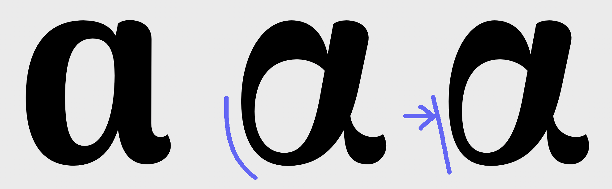

## Journal of process

**180415** ~ *GitHub and dropbox settings, analysing Arima font sources*

**180517-21** ~ *Firsts sketches for alpha and pi.*  
Arima has vertical orientation and contrasts. Despite of its calligraphic feel, it is very straight. The drawing of the "a script" and the symbol "pi" in the Latin set follow this orientation. We could transfer these characteristics to the rest of the Greek set and the gray between the two scripts would be homogeneous. Another direction would be to take an orientation more specific to the Greek in order to have a more dancing set and more distinguished from the Latin set — the Greek writing being not determined by the same tools and the same ductus as Latin.

*First letter to fourth were already designed in the original source (firsts alpha and pi could be used for the greek set). Last alpha and pi are firsts sketches.*

*The sketche of the alpha is very soft compare to the other scripts, may be we could integrate more straightness.*

**180522-23** ~ *Research of style with alpha and epsilon.*  
I am still looking wether I want the weight on the horizontal or on the vertical strokes. Moreover Arima has smooth junctions.

*1st alpha : the weight is on the horizontal strokes. ~ 2nd alpha : the weight is on the vertical strokes. ~ The last 2 have smooth junctions so that the style is closer to the latin source.*

I am not giving up on a more "modern" style and this is the evolution between the first more "calligraphic" style to a more "modern" one.

I ended up with three different styles with its corresponding epsilon. I will continue developing those three styles on few other letters before choosing.

*1st : "calligraphic" ~ 2nd : "transitional" ~ 3rd : "modern".*
