## Journal of process

**180415** ~ *GitHub and dropbox settings, analysing Arima font sources*

**180517-21** ~ *Firsts sketches for alpha and pi.*  
Arima has vertical orientation and contrasts. Despite of its calligraphic feel, it is very straight. The drawing of the "a script" and the symbol "pi" in the Latin set follow this orientation. We could transfer these characteristics to the rest of the Greek set and the gray between the two scripts would be homogeneous. Another direction would be to take an orientation more specific to the Greek in order to have a more dancing set and more distinguished from the Latin set — the Greek writing being not determined by the same tools and the same ductus as Latin.

I am working on the bold for now to set the contrasts.

*First letter to fourth were already designed in the original source (firsts alpha and pi could be used for the greek set). Last alpha and pi are firsts sketches.*

**180522-23** ~ *Research of style with alpha and epsilon.*  
I am still looking wether I want the weight on the horizontal or on the vertical strokes. Moreover Arima has smooth junctions.

*1st alpha : the weight is on the horizontal strokes. ~ 2nd alpha : the weight is on the vertical strokes. ~ The last 2 have smooth junctions so that the style is closer to the latin source.*

I am not giving up on a more "modern" style and this is the evolution between the first more "calligraphic" style to a more "modern" one.

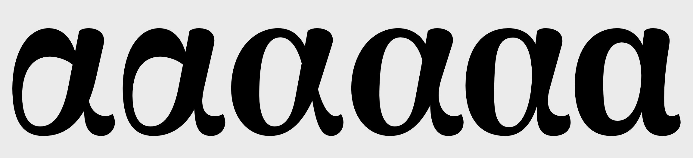
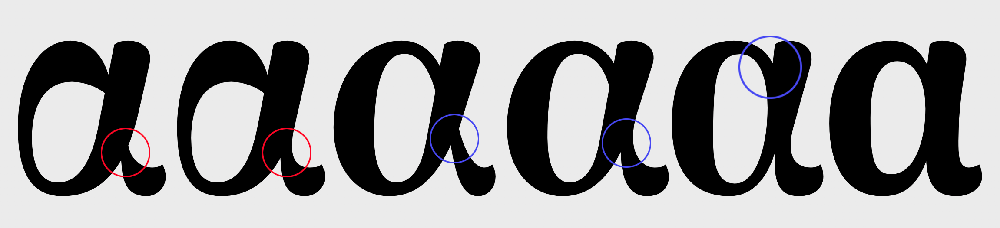

I ended up with three different styles with its corresponding epsilon. I will continue developing those three styles on few other letters before choosing.

*1st : "calligraphic" ~ 2nd : "transitional" ~ 3rd : "modern".*

**180524-28** ~ *Still searching…*  
Having trouble distributing the weight in alpha, mu and eta. For omicron, rho, iota and epsilon there is no such confusion.

Arima have smooth junctions but straight stems. For the Greek, the stems are loose do to the angle and it could be interesting having some crossing junctions to recover some straightness.

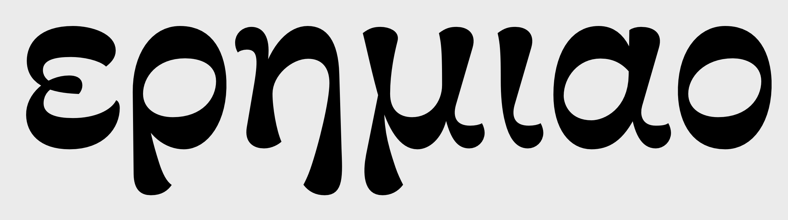
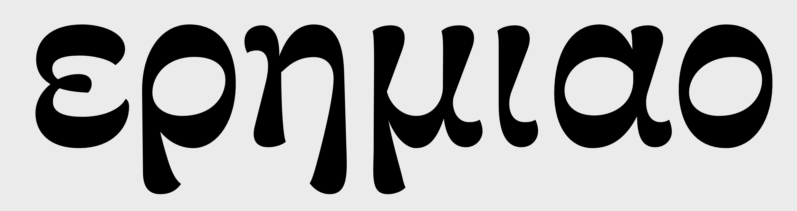
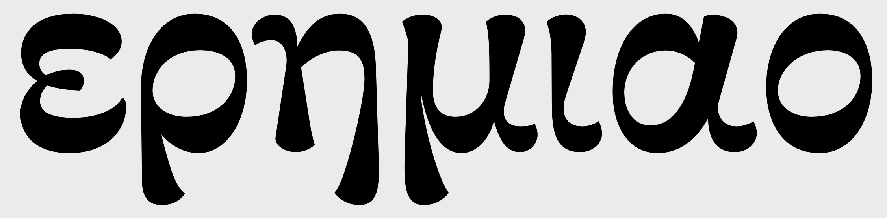
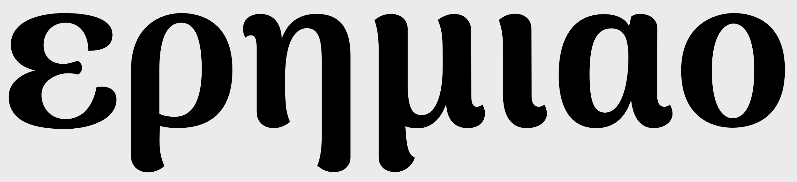
*Several directions possible.*

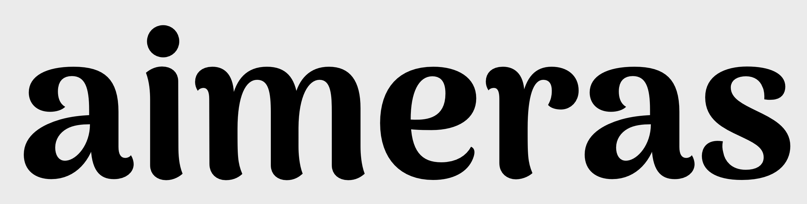
*A latin word from the source for comparaison.*

**180525-31** ~ *Developing 5 styles*  
This is the five styles I developed on few letters to build a first specimen.

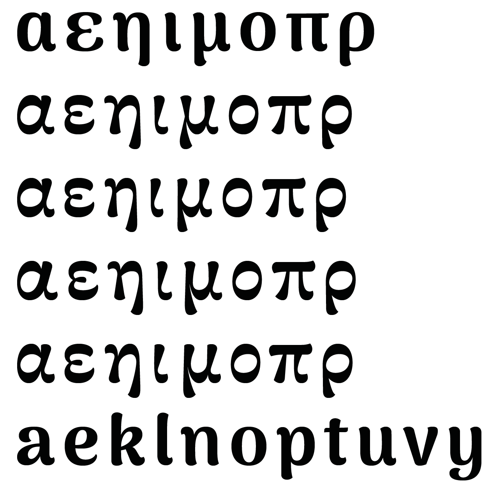
*To match the source, the glyphs need to be fatter and more condensed. See [the pdf of the first specimen](https://github.com/eellak/gsoc2018-arimamadurai/blob/master/00_PROCESS/04_PDF/180529-specimen.pdf) to have a look at the first specimen.*

**180525-31** ~ *Working on the 5th style* 
I chose the last one and make it more condensed. I added the tonos to compose a text and have a first look.

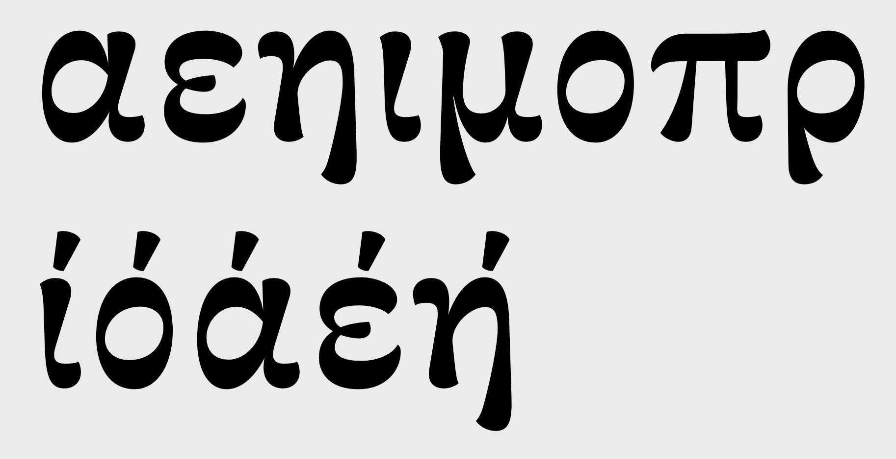
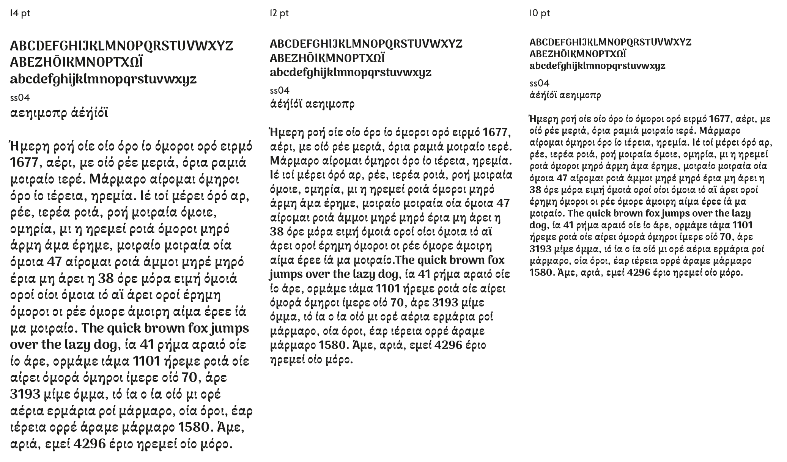
*The glyphs still need to be fatter. Here [the pdf of the second specimen](https://github.com/eellak/gsoc2018-arimamadurai/blob/master/00_PROCESS/04_PDF/180601-specimen-ss04.pdf).*

Waiting for feedbacks, I tested this choice on the thin weight which is basically mono-linear.

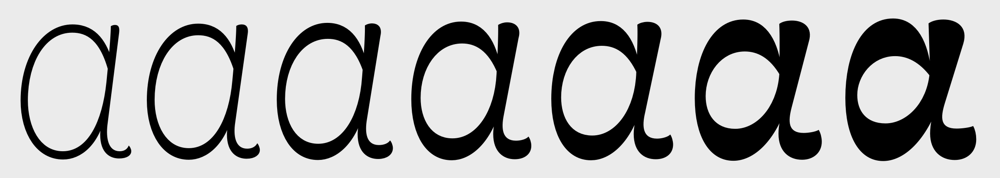
*I tried a first interpolation test to see if the transition between weights works .*

**180601-03** ~ *Feedbacks* 
The feedback from Emilios was that the alphabet was well designed but didn't matched well enough the latin. I should try to give it more weight due to the horizontal stresses. I should also try to develop a version with vertical stresses but less shy than the one I suggested from the original letters of the source.

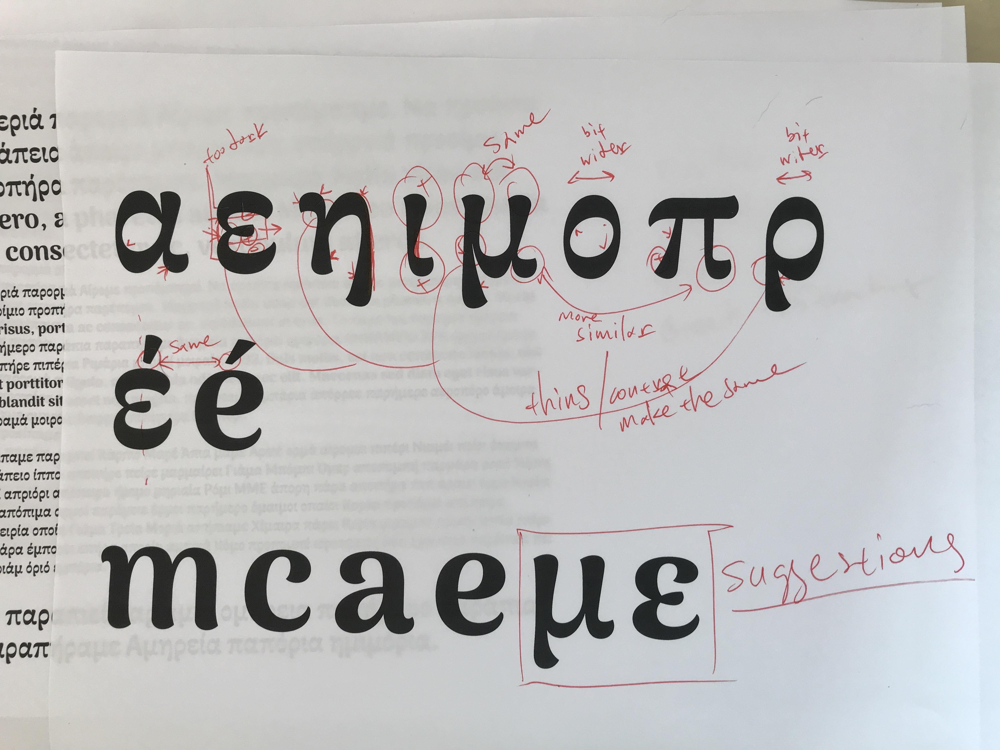
*Emilios' corrections and suggestion of design for the vertical one.*

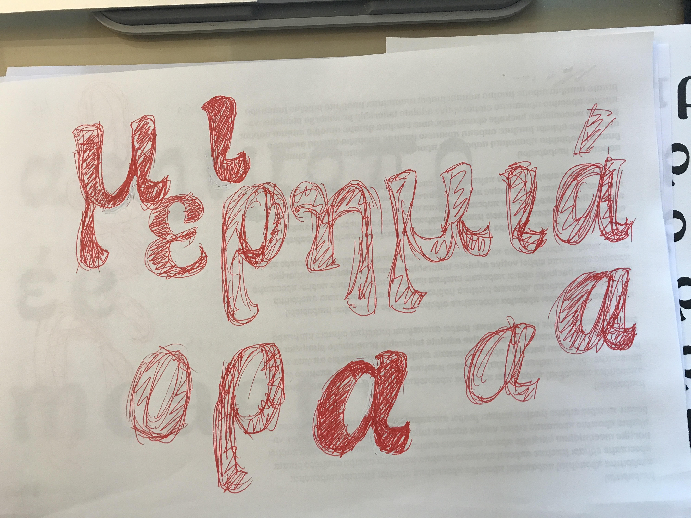
*Emilios' sketches.*

**180604-06** ~ *New sketches* 
I first added some weight in the previous version to see if it fits better with the Latin. Then I sketched a version with a diagonal stress to see if a slight inclination of the stress would manage better the weight difference.

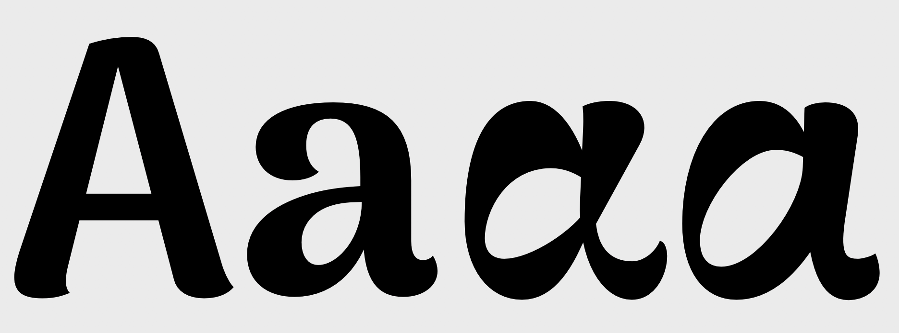

Finally I made a version with vertical stresses. It is really hard for a novice in Greek script cause it is easy to fall into Latin shapes with that orientation and the letters lose their Greek touch (and that's a shame cause it is what's interesting in designing a Greek typeface…).

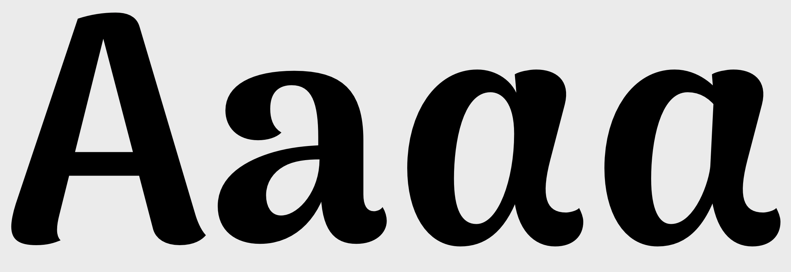
*This version is nice but we have lost what was interesting in the other versions. It is still shy for a display version.*

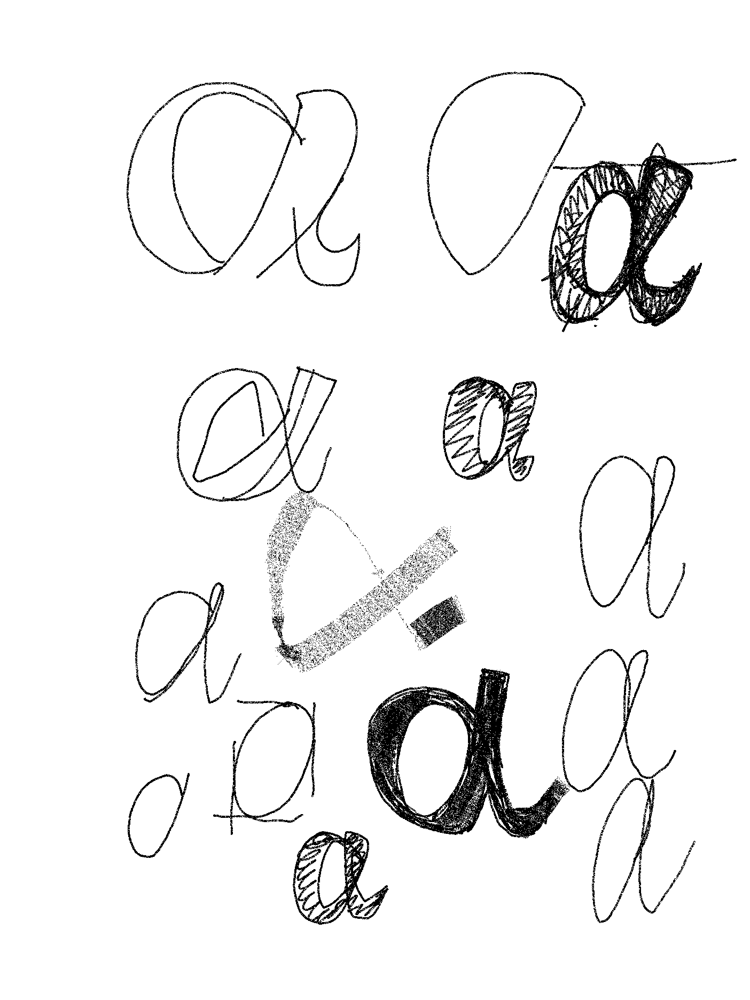
*Drawings just help to understand the ductus and for Greek script the ductus can be almost whatever you want…*

According to sketches and finding new examples of nice Greek typefaces, I sketched other alphas. The idea is to inject more of that scripting touch we had in the other versions.

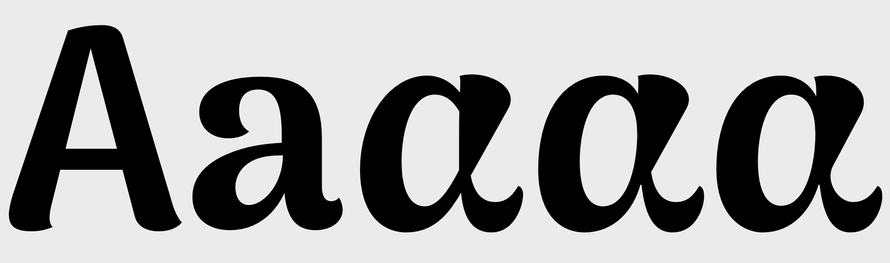
*Here it works but the contrasts don't match the Latin.*

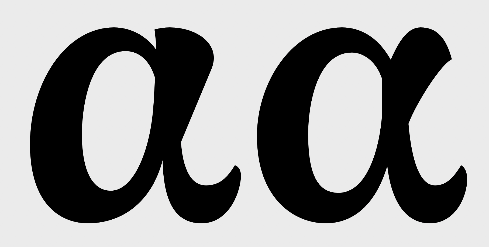
*Finally it is just a question of weight in the spur.*

I developed very quickly the three versions to have a general look :

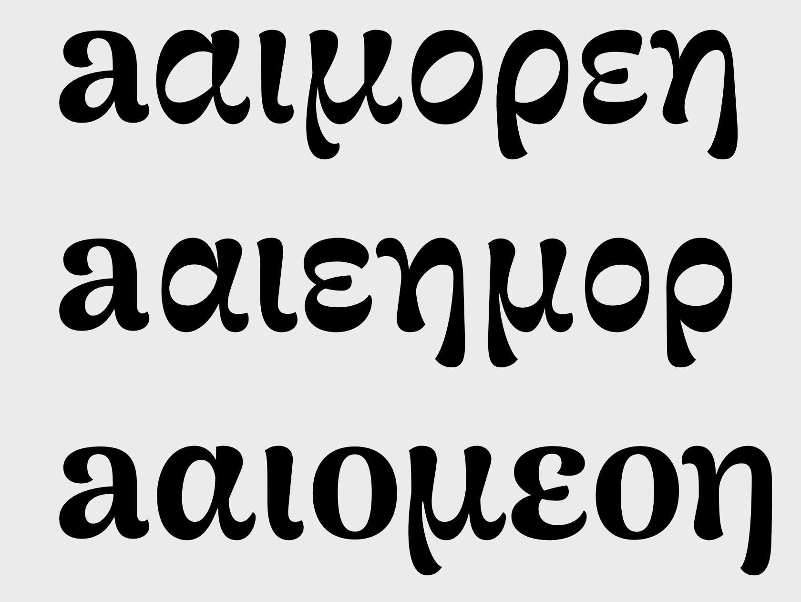
*I prefer the first two versions but without contest, the third matches better the Latin and therefore will be easier to develop. I am satisfied though cause the vertical one is not as boring as the first attempt and still have its Greeky touch.*

**These are the typefaces I look at along the project :**

* *Eczar* — Emilios Theofanous (for the Greek)
* *Brill* — John Hudson et Alice Savoie
* *SBL* — John Hudson
* *Eqil* — Kostas Bartsokas
* *Capucine* — Alice Savoie
* *Parmigiano* — Irene Vlachou (for the Greek)
* *Colvert* — Irene Vlachou (for the Greek)
