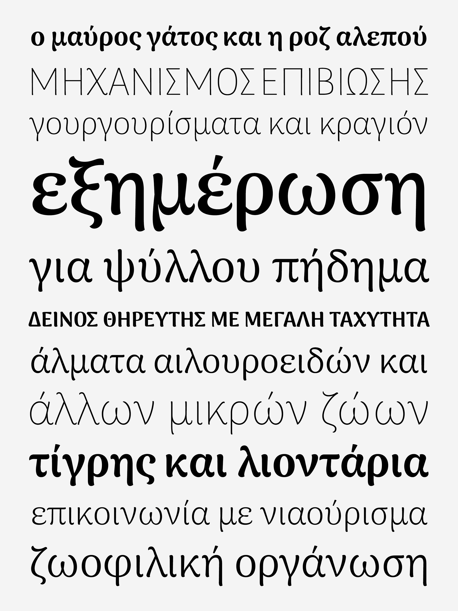
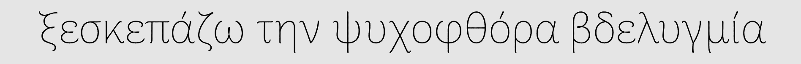

### gsoc2018-arimamadurai
## Adding Greek glyphs to the open source font Arima Madurai

### Introduction

The Project took place during the Google Summer of Code 2018 and aimed to add Greek script to the Google Font [Arima Madurai](https://github.com/NDISCOVER/Arima-Font).

Arima Madurai is a font created by Natanael Gana and Joana Correia of NDISCOVER — a Portuguese type foundry. It is a multiscripts display font with 8 weights from thin to black and have a strong calligraphic influence. It has a lot of personality so it can be recognisable in headlines or brand names uses.

Regarding the history of Greek script, it is interesting and challenging to design a typeface with a calligraphic feel: in terms of design but also in terms of study. There are remarkable examples of Greek punch cutting from the most talented historical figures.

Arima Madurai already supported Tamil, Malayalam and Latin scripts and with this project, Greek script was added to the glyphset. The fact that the font already supported multi scripts was a real benefit to the project: Arima Madurai already acted in a non latin typographic environment and therefore displayed a large set of shapes that were used to match the Greek glyphs with the other ones.

**You can found [here](https://github.com/eellak/gsoc2018-arimamadurai/blob/master/00_PROCESS/07_SPECIMEN/180812_characterset.pdf) a PDF of the Greek character sets that was added to Arima Madurai.**

---

### Timeline:

<b>May 14 — June 14 Formal :</b> researches / sketches for basic characters in both thin and black weights.

<b>June 15 :</b> Phase 1 evaluation deadline.

<b>June 16 — July 12 :</b> Lowercases, uppercases, diacritics for the thin weight + lowercases for the black weight.

<b>July 13 :</b> Phase 2 Evaluation deadline.

<b>July 13 — August 13 :</b> Uppercases, diacritics for the black weight + kernings + interpolation

<b>August 13 - 16 :</b> Final week dedicated to eventual delays. Adding polytonic if time permits it.

<b>August 14 - 21  :</b> Phase 3 Final Evaluation.

See here a detailed [TimeLine](https://github.com/eellak/gsoc2018-arimamadurai/blob/master/TIMELINE.md).

---
### Process:

* [Process Diary](https://github.com/eellak/gsoc2018-arimamadurai/blob/master/00_PROCESS/00_JOURNAL.md).
* [UFO files](https://github.com/eellak/gsoc2018-arimamadurai/tree/master/00_PROCESS/02_UFO)
* [Glyphs files](https://github.com/eellak/gsoc2018-arimamadurai/tree/master/00_PROCESS/01_GLYPHS)

This is a small pangram animation, from Thin to Bold and back, demonstrating the changes of the final design that occur as weight is added:

---
### Deliverables:
* [OTF files](https://github.com/eellak/gsoc2018-arimamadurai/tree/master/01_DELIVERABLES/OTF)
* [TTF files](https://github.com/eellak/gsoc2018-arimamadurai/tree/master/01_DELIVERABLES/TTF)
---

### GSoC Mentors:

* Emilios Theofanous | [GitHub](https://github.com/thynem) | [Twitter](https://twitter.com/emilios__)
* Irene Vlachou | [GitHub](https://github.com/irenevl) | [Twitter](https://twitter.com/irene_vlachou)
* Alexios Zavras

### Student:

* Rosalie Wagner | ANRT, Nancy | [GitHub](https://github.com/RosaWagner) | [Twitter](https://twitter.com/RosaFF_Wagner)

### Organization:

[Open Technologies Alliance - GFOSS](https://summerofcode.withgoogle.com/organizations/4954936912117760/)

---

### License

The fonts and related code are licensed under [Open Font License](https://github.com/NDISCOVER/Arima-Font/blob/master/OFL.txt). See `LICENSE.txt` for licensing information.
